# 📚 Library Management System

A simple **SQL-based Library Management System** designed to manage students, books, and borrowing transactions. This project demonstrates the use of **relational database design** with constraints such as primary keys, foreign keys, uniqueness, and checks.


---
## 🚀 Features

* **Student Management**: Store details like name, course, year of study, and unique email ID.
* **Book Management**: Store details of books including title, author, category, and available copies.
* **Transaction Handling**: Track borrowing, returning, due dates, and fines.
* **Data Integrity**: Enforced through constraints like `PRIMARY KEY`, `FOREIGN KEY`, `UNIQUE`, and `CHECK`.

---

## 🗄️ Database Schema

### **1. STUDENTS Table**

```sql
CREATE TABLE STUDENTS (
    STUDENT_ID INT PRIMARY KEY,
    NAME VARCHAR(100) NOT NULL,
    COURSE VARCHAR(100) NOT NULL,
    YEAR_OF_STUDY INT,
    EMAIL VARCHAR(150) UNIQUE CHECK (EMAIL LIKE '%_@_%._%')
);
```

### **2. BOOKS Table**

```sql
CREATE TABLE BOOKS (
    BOOK_ID INT PRIMARY KEY,
    TITLE VARCHAR(200) NOT NULL,
    AUTHOR VARCHAR(150) NOT NULL,
    CATEGORY VARCHAR(100),
    TOTAL_COPIES INT NOT NULL
);
```

### **3. TRANSACTIONS Table**

```sql
CREATE TABLE TRANSACTIONS (
    TRANSACTION_ID INT PRIMARY KEY,
    BOOK_ID INT,
    STUDENT_ID INT,
    BORROW_DATE DATE NOT NULL,
    RETURN_DATE DATE,
    DUE_DATE DATE NOT NULL,
    FINE_AMOUNT DECIMAL(10,2) DEFAULT 0,

    CONSTRAINT FK_BOOK FOREIGN KEY (BOOK_ID) REFERENCES BOOKS(BOOK_ID),
    CONSTRAINT FK_STUDENT FOREIGN KEY (STUDENT_ID) REFERENCES STUDENTS(STUDENT_ID)
);
```

---

## 🔄 System Workflow

```mermaid
flowchart TD
    A[📚 Student Registers] --> B[🔍 Browse Books]
    B --> C{Book Available?}
    C -->|Yes| D[✅ Borrow Book]
    C -->|No| E[⏳ Waitlist / Try Again]
    D --> F[📝 Record Transaction]
    F --> G[📆 Due Date Assigned]
    G --> H[🔄 Return Book]
    H --> I{On Time?}
    I -->|Yes| J[🎉 Close Transaction]
    I -->|No| K[💰 Fine Calculation]
    K --> J
```



---

## 🍰 Entity Distribution Example


---

## 🗂️ Entity Relationship Diagram (ERD)


---

## 📊 Example Queries

* **Add a new student**

```sql
INSERT INTO STUDENTS (STUDENT_ID, NAME, COURSE, YEAR_OF_STUDY, EMAIL)  
VALUES (1, 'John Doe', 'Computer Science', 2, 'john.doe@example.com');
```

* **Issue a book**

```sql
INSERT INTO TRANSACTIONS (TRANSACTION_ID, BOOK_ID, STUDENT_ID, BORROW_DATE, DUE_DATE)  
VALUES (101, 1, 1, '2025-09-01', '2025-09-15');
```

* **Return a book with fine update**

```sql
UPDATE TRANSACTIONS  
SET RETURN_DATE = '2025-09-20', FINE_AMOUNT = 50.00  
WHERE TRANSACTION_ID = 101;
```

---

## 🎯 Future Enhancements

* Implement triggers for **automatic fine calculation**
* Add a **login system** for admin and students
* Create **stored procedures** for common operations
* Build a **frontend application** (web or desktop) connected to the database

---

## 🛠️ Tech Stack

* **Database**: MySQL / PostgreSQL / Oracle
* **Language**: SQL
* **Optional Extensions**: Can be integrated with Java, Python, or PHP

---

## 🤝 Contribution

1. Fork this repository.
2. Create your feature branch (`git checkout -b feature-name`).
3. Commit changes (`git commit -m "Added feature XYZ"`).
4. Push to branch (`git push origin feature-name`).
5. Open a Pull Request.

---
